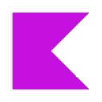

# Hi there, I'm Satwik Kaushik 👋

## 🚀 Aspiring Android Developer | Machine Learning Enthusiast

I'm a Computer Science & Engineering student at Graphic Era Deemed to be University, passionate about creating innovative mobile applications and exploring the intersection of Android Development and Machine Learning.

### 💡 Core Competencies:
- **Android Development:** Proficient in Kotlin and Java
- **UI/UX:** Experienced with Jetpack Compose for modern, responsive interfaces
- **Problem Solving:** Strong foundation in Data Structures and Algorithms with 250+ problems solved on LeetCode
- **Machine Learning:** Hands-on experience with Scikit-learn, TensorFlow, and NLP applications

### 🛠️ Project Highlights:
- **"Emotions Behind The Screen":** A Sentiment Analysis application for online course reviews, achieving 93% accuracy
- **Handwritten Digit Recognition:** CNN-based system achieving 97.36% accuracy
- **"Boxed":** An efficient file archival tool in Java

### 🔧 Technical Toolkit:
- **Languages:** Java, Kotlin, Python, Bash, C
- **Frameworks & Libraries:** Android SDK, Scikit-learn, TensorFlow, NLTK, SpaCy, JDBC
- **Developer Tools:** Android Studio, IntelliJ IDEA, VS Code
- **Version Control:** Git, GitHub

### 🎯 Career Objectives:
Seeking opportunities to apply my skills in Android development and machine learning to create impactful mobile applications. Eager to contribute to forward-thinking teams and take on challenges that push the boundaries of mobile technology.

I'm always open to discussing innovative projects or how my skills can add value to your team. Let's connect and explore how we can advance the future of Android development and AI integration together!

### 📫 How to reach me:
- LinkedIn: [satwikkaushik](https://www.linkedin.com/in/satwikkaushik)
- Email: satwikkaushik03@gmail.com

 

